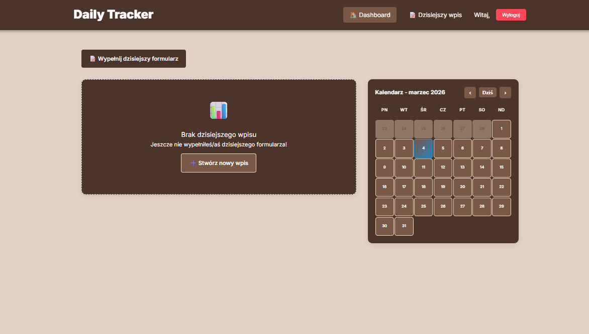
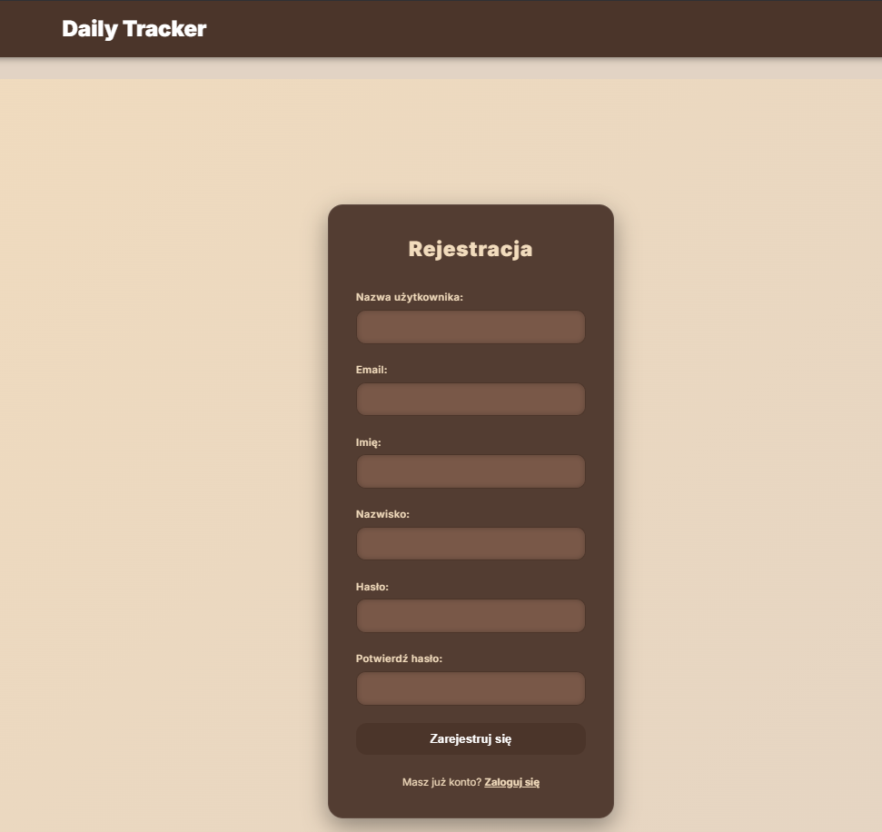
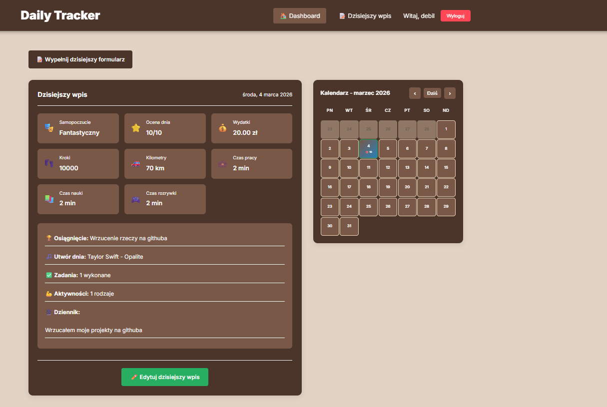
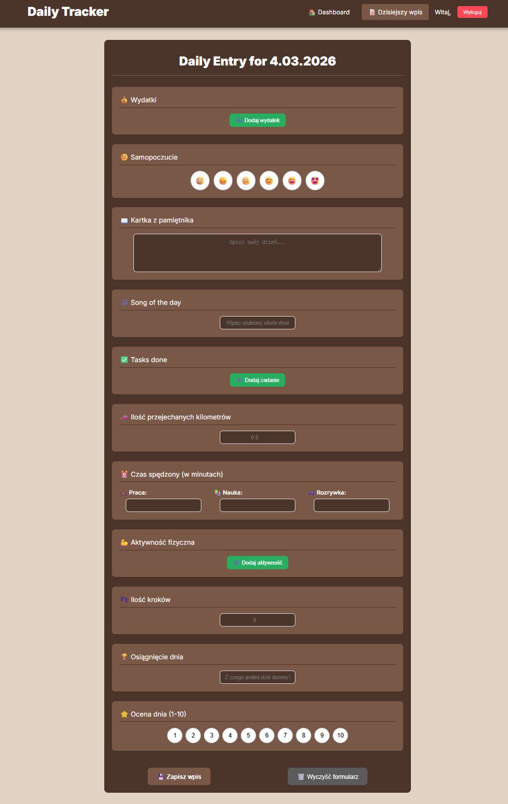

# Django Auth Backend 🚀

Backendowa część aplikacji do autentykacji użytkowników, zbudowana w Django REST Framework z obsługą JWT. Projekt stanowi fundament dla aplikacji Tracker, umożliwiając bezpieczne zarządzanie użytkownikami i ich danymi.

## 🛠 Technologie

- **Django 4.2.7** - główny framework
- **Django REST Framework 3.14.0** - API
- **Simple JWT 5.3.0** - tokeny JWT
- **Django CORS Headers 4.3.1** - obsługa CORS
- **Python Decouple 3.8** - zarządzanie zmiennymi środowiskowymi

## 📸 Podgląd Panelu (Screeny)

<p align="center">
  
  </p>
  <p align="center">
  
</p>
<p align="center">
  
  
</p>
<p align="center">
  
</p>
## 📦 Instalacja

### Wymagania wstępne
- Python 3.8+
- pip

### Kroki instalacji

1. **Sklonuj repozytorium**
```bash
git clone [https://github.com/twoja_nazwa/Tracker_backend.git](https://github.com/twoja_nazwa/Tracker_backend.git)
cd Tracker_backend

# Windows
python -m venv venv
venv\Scripts\activate

# Linux/Mac
python3 -m venv venv
source venv/bin/activate

python manage.py runserver
